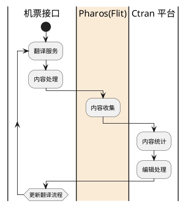
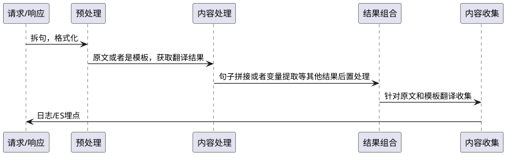
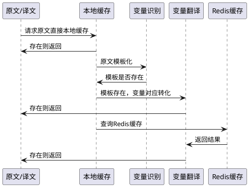
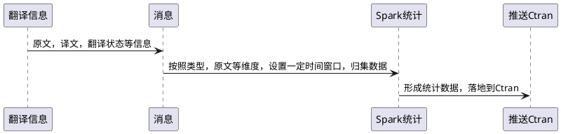
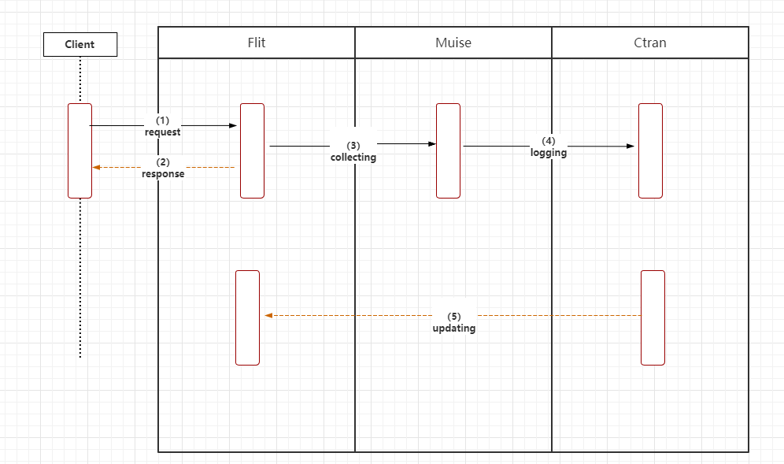
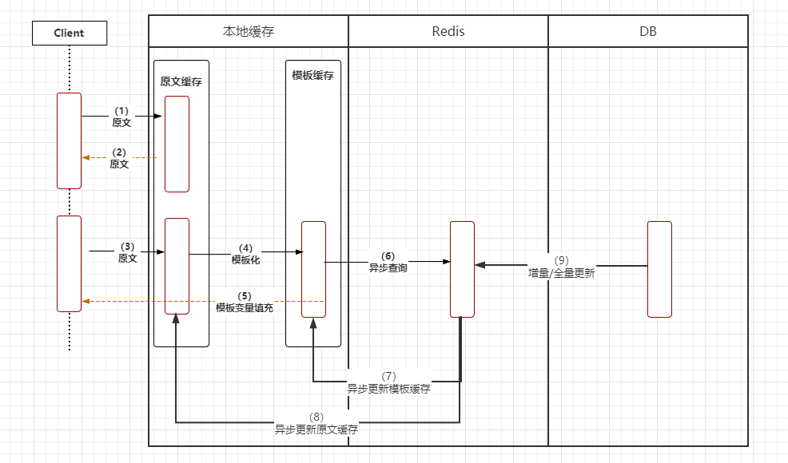

[[toc]]
# Flit 实时模板翻译设计
- Flit core: 提供机票翻译线上接口

- Flit datastream-collection: 房型翻译的数据保存CmongoDB 和推送消息给IBU多语言酒店
- Flit for job: 机票job翻译翻译
- Flit general trans
    - 房型名翻译
    - Ctran内部数据等
    - 地址翻译等其他

## flit-core(Flight translation)

### 背景

Flit 主要是提供给机票实时翻译接口，机票翻译的主要是政策类数据，机票退改签和备注。机票调用很多都是重复调用，数据重复，且数据变更的都是一些地点，日期，数字以及金额之类的。

### 流程图
#### 整个Flit翻译及数据更新

#### 翻译时序图

##### a.预处理
###### 句子拆分
按照规则拆分句子，同时要保护一些情况下不需要拆分，比如英文句号，英文句号可能是数据标点。
###### 格式化
针对不同的语言情况下，现在就2大类，中文和及其他（其他一般指的是英文）。
中文：空格处理等
英文：多个空格等

##### b.内容处理

###### i. 本地缓存

原文请求等是被动缓存，原文请求会被动缓存下来，过期时间短。

配置模板第是主动缓存，程序启动初始化，后面增量更新指本地缓存。

###### ii. Redis 缓存

​	Flit有专门的job全量/增量写入redis.

###### iii. 变量识别

- 数字
- 日期
- 城市/机场三字码
- 币种

数字，日期和币种都是结构化数据，可以通过正则识别。

城市/机场三字码是通过双数组数据结构，进行识别。

机票翻译接入了很多类型，每种类型配置了不同的变量识别。

###### iv.变量翻译

数字，币种可以转化为一个钟通用的格式。

日期通过引入shark组件本地化

城市/机场三字码，依赖是编辑翻译，可以理解有一张配置表。
##### c.内容组合
翻译是基于句子去翻译的，请求的内容可能是多个句子，每种语言的句子结尾都不一样。处理也是不一样。
另外不同的要求，有些需要对翻译内容，提取一些变量，比如机票需要提取币种。
根据定义的契约，组合对应的响应。 
##### d.内容收集

## Flit 模板实时交互图

1.  步骤1~2 是同步的，发送请求，同步获取响应，完成Flit在线实时模板翻译。
2. 步骤3~5 是异步进行的，通过QMQ解耦。
3. 步骤3，收集Flit 请求与响应，同步Muise平台归集Flit数据。
4. 步骤4，Muise归集好的Flit数据，通过QMQ传入Ctran平台。
5. 步骤5，编辑/运营人员根据Ctran归集好的数据，处理未翻译模板数据。

## Flit 缓存策略

应用初始化，loading 模板至本地缓存（大概只在100M 左右）。

1. 原文缓存是被动缓存，请求结果/响应存入caffeine，设置好大小以及过期策略。
2. 模板缓存，主动缓存+查询被动缓存。首次的时候，全量同步DB数据至本地缓存，剩下就是查询后异步去redis同步至本地。好处就是：所有请求都走本地，异步校验模板存在问题。
3. Redis缓存只是作为中间查询使用，不是强依赖。
4. DB数据变更，主动触发Redis和本地缓存一致性。