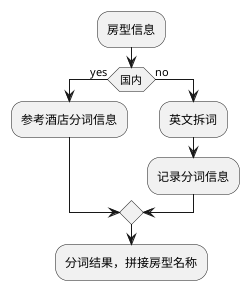

[[toc]]
### 英文分词

#### 一、目标

现在仅仅是为了比较中文和英文分词结果上对比，需要把中文分词结果和英文分词详情展现出来，方便后续优化对比。

#### 二、流程
##### 分词翻译流程


##### 英文拆词

```plantuml
:ctran载入英文词典;
:预处理（大小写，空格等）;
:最大长度匹配;
if(完全切词) then(yes)
else(no)
:基于统计模型（Stanford coreNLP/Hanlp）;
endif
:后续处理（单词维度拆词）;
```

##### 基于统计模型接口或者Rest

加载模型需要比较大的内存，服务本身不影响主应用服务，最好能提供SOA/Rest 形式提供基于统计的英文切词。
模型英文切词是基于成分句法分析（NP 和VP） 具体可以参考https://ask.hellobi.com/blog/wangdawei/36563

Standford CoreNLP: 支持java 

Hanlp : java/python 都支持

##### 成分句法分析
###### stanford coreNLP
tokenize,ssplit,lemma 针对语言相关

```plantuml
:Tokenize;
:ssplit;
:POS;
:lemma;
:ner;
note: 非必须
:parse;
```
######  hanlp

```plantuml
:Tokenize;
:POS;
:ner;
note: 非必须
:syntactic_parser;
```
需要根据这些判断 相邻关系是否能构成一个词

##### 分词信息

```plantuml
:英文和中文分词信息;
:信息入库;
```

```segment_info```

| col_name        | data_type | comment                        |
| --------------- | --------- | ------------------------------ |
| basicroomtypeid | int       | 基础房型ID                     |
| roomname        | string    | 房型名称                       |
| countryid       | int       | 国家信息                       |
| source          | string    | EN/CN 中文分词还是英文分词     |
| segmetType      | string    | 字典还是第三方统计抑或是模型等 |
| properword      | string    | 专有词                         |
| landscape       | string    | 景观                           |
| level           | string    | 级别                           |
| maxguests       | string    | 入住人数                       |
| roomtype        | string    | 房型                           |
| bedroom         | string    | 卧室                           |
| bedtype         | string    | 床型                           |
| annex           | string    | 附件                           |
| attributetag    | string    | 属性标签                       |
| pendword        | string    | 待处理                         |

##### 分词信息统计

根据```segment_info_statistic``` 生成统计信息

| col_name               | data_type | comment    |
| ---------------------- | --------- | ---------- |
| basicroomtypeid        | int       | 基础房型ID |
| roomcname              | string    | 房型名称   |
| roomename              | string    | 房型名称   |
| 定义需要关注的统计维度 |           |            |


#### Ctran 支持英文分词维护


- 分词词库改造，增加分词来源语言，根据不同语言载入到字典

  | col_name     | data_type  | comment                    |
  | ------------ | ---------- | -------------------------- |
  | id           | int        | ID                         |
  | key          | string     | 分词key                    |
  | type         | string     | 分词类型                   |
  | **language** | **string** | **分词key 语言（CN和EN）** |

- Ctran 维护： CRUD

  导入解析需要扩展language字段

- 词库载入


#### 工作点

- Ctran 房型词库维护
  - CRUD
  - 导入
- 房型翻译流程增加英文切词流程
  - 增加基于英文字典切词方法
  - 嵌入到原有的流程
  - 切词的所有细节，记录埋点
- 基于统计模型切词，包装成服务
  - 基于StandFord CoreNPL/Hanlp 成分句法分析，切词合理的词
  - 研究分词模型，POS模型，以及句法分词模型
  - 针对输出的结果，按照特殊性做一些规则判断
- 英文切词细节记录
  - 中文切词细节
  - 基于字典切词细节
  - 基于统计模型切词细节