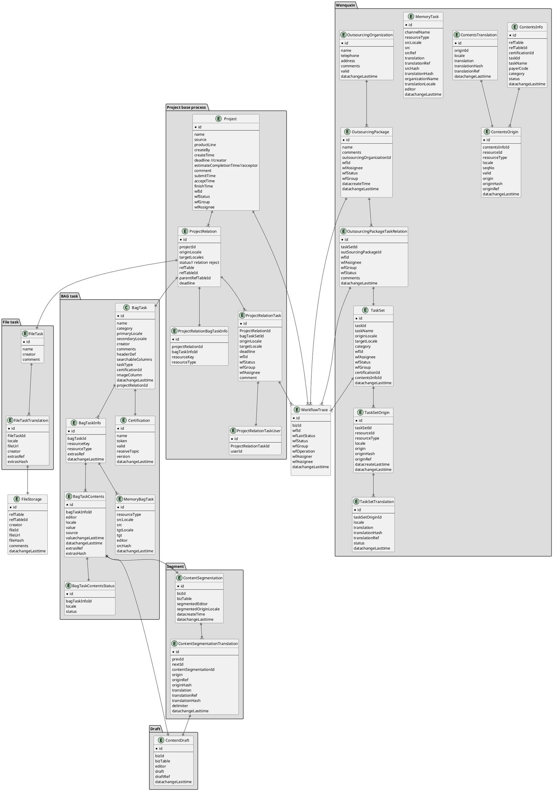
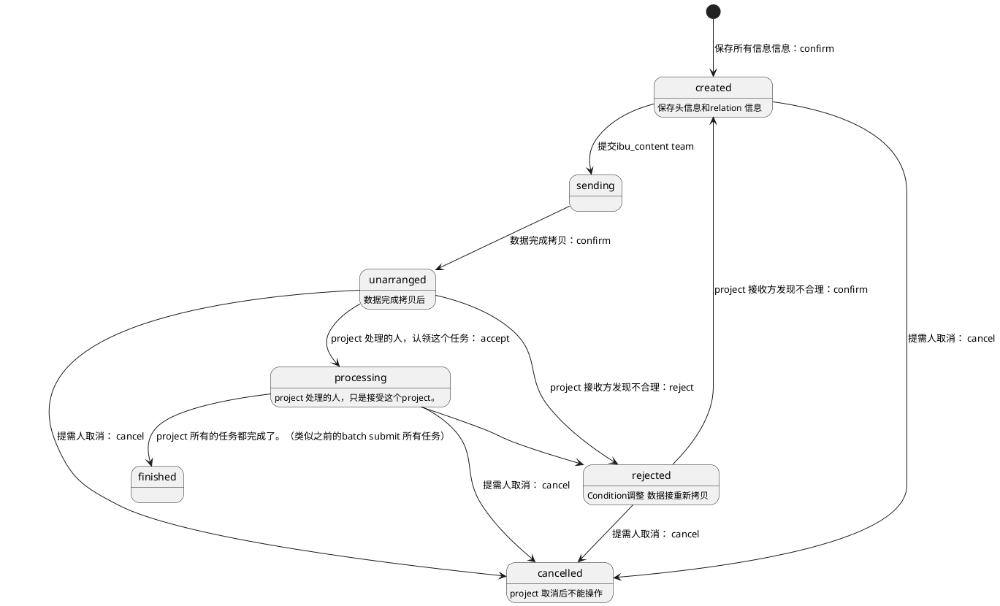
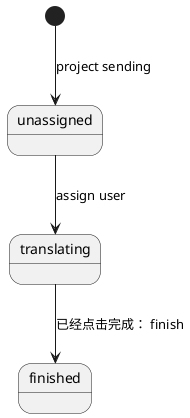
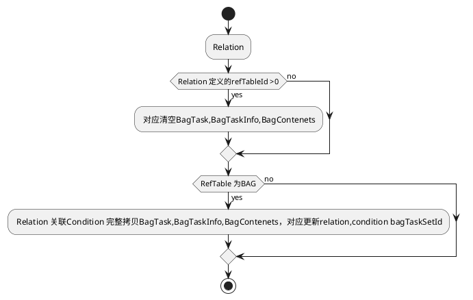
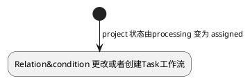
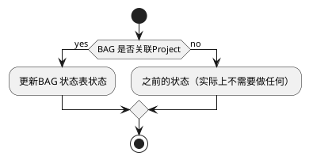

[[toc]]
# TUMA
## 前言
## 一、需求
## 二、Tuma ER图



## 三、技术设计
### 1. BAG Task
#### a) BAG task translation(列表页翻译)


##### i. 搜索

支持不同维度对BAG进行搜索

##### ii.工具

删除，添加，下载，预翻译以及自动记忆翻译支持locales。
##### iii. 展示区
1. 支持按照翻译内容状态过滤。
2. 展示所有对应Key下的所有列表。
##### iv. 提示区
1. Matched 包括记忆库，google，tripAI等提示。
2. History 翻译历史。
3. Summary 针对原文统计信息。
4. Glossary
5. Search
##### v. 翻译区
1. 原文内容展示，可以选择不同locale作为原文。
2. 翻译，包括草稿和内容保存。
#### b) Two column view（双栏翻译）


##### i. 搜索区域

不同维度搜索支持

##### ii. 查找&替换

1. 查找替换都是基于当前页的数据实现的，实现逻辑集成在前端。
##### iii. 工作区域

1.内容和草稿保存

2.复数支持

##### iv. stack mode
1. 后台支持接口，点击Plural，自动生成对应支持的key 列表。
2. stack 翻译列表
##### v. 提示区

#### c) 数据接收


 1. 编辑翻译+导入

    编辑线上编辑内容或者线下翻译完，导入至TUMA平台。

 2. 接口接收

    业务线下申请token，TUMA创建BAG task，线下发放token和bag taskID ，业务方推送数据。

#### d) 数据推送


在 BAG 翻译的数据，都需要在数据确认完，自动推送给业务方，主要是通过业务方申请的token，确定接收数据topic.


### 2. Project

tuma 的翻译任务来源主要有以下几种：

```plantuml

rectangle tuma


rectangle bag
rectangle file
rectangle 文曲星

tuma --> bag
tuma --> file
tuma --> 文曲星

```
#### 1.project 工作流

#### 2. Projet relation 对应下Bag的工作流

#### 3. BAG task translation 数据拷贝
数据拷贝：
 1. 如果relation 清空后，再拷贝，发生在Project reject 重新后再调整。
 2. relation 只需要拷贝。
 3. BAG content 状态需要把unchecked更新为初始化状态；
    之前的状态有：translated,unchecked,empty,draft,myDraft 四个状态，现在增加一种inited,代表从旧的Task拷贝而来，前提是之前存在的值，这个过程只发生在Project 处于assigned分配过程中。


#### 4. BAG 初始化状态（Project情况下）
1. 对应需要生成需要指定的Task 负责人的表。
2. 真正意义上Task 工作流


#### 5. BAG Translation 状态


#### 6. 数据权限

a. 传入的参数
1. user
2. user+project
3. user+project+task

b. 数据过滤
    根据用户和业务数据本身过滤
c.数据操作
    根据用户和数据本身限定
d. User 语言能力
e. Group User语言能力    

#### 7. Project 后端API

 a. query
 b. createOrUpdate
 c. relationCreateOrUpdate
 d. submit
 e. accept
 f. reject

#### 8. Relation 后端API

 a. query
 b. reject
 c.  change
 d. assign
 e. redirect
#### 9. BAG translation 后端API 调整

 a. query
 b. save
